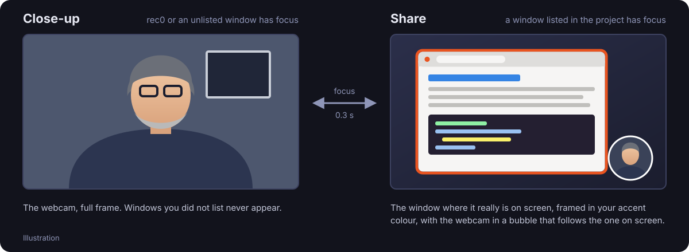
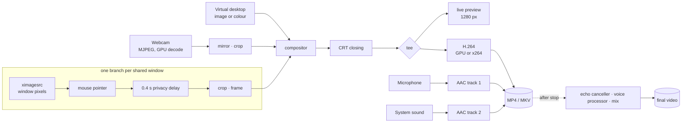

<div align="center">


# rec0

**Declarative screencast recorder for GNOME.**
Describe the session once in a small YAML file, press record, and just work:
rec0 cuts between your webcam and your windows on its own, keeps private pages
out of the video, and hands you a file with clean, YouTube-ready sound.

[](https://github.com/francescobianco/rec0/releases/latest)
[](https://github.com/francescobianco/rec0/actions/workflows/release.yml)
[](LICENSE)

</div>

---

## Install

On Ubuntu 24.04 or later (or Debian 13), download the latest package and
install it:

```bash
curl -fsSLO https://github.com/francescobianco/rec0/releases/latest/download/rec0_all.deb
sudo dpkg -i rec0_all.deb || sudo apt-get install -f -y
```

`dpkg -i` installs the package; if some dependencies are missing it stops,
and `apt-get install -f` fetches them and completes the installation. In one
step, letting apt resolve everything:

```bash
curl -fsSL -o /tmp/rec0_all.deb https://github.com/francescobianco/rec0/releases/latest/download/rec0_all.deb
sudo apt install /tmp/rec0_all.deb
```

Then open **rec0** from the Activities overview, or run `rec0`.

| Fixed download links (always the latest release) | |
|---|---|
| Debian/Ubuntu package | <https://github.com/francescobianco/rec0/releases/latest/download/rec0_all.deb> |
| Release page | <https://github.com/francescobianco/rec0/releases/latest> |

Every release also carries the versioned file (`rec0_<version>_all.deb`); a
specific version is at `https://github.com/francescobianco/rec0/releases/download/v<version>/rec0_<version>_all.deb`.
To remove rec0: `sudo apt remove rec0`.

## How it works

The video is always composed on a **virtual desktop** (an image or a colour),
and rec0 shows one of two scenes on it. The scene follows the window focus,
with a short transition:

<p align="center"></p>

| Scene | When | What the video shows |
|---|---|---|
| **Close-up** | rec0, or any window *not* listed in the project, has focus | the webcam |
| **Share** | a window listed under `windows` has focus | that window, at the **same position and size** it has on your screen, in an accent-coloured frame, with the webcam in a circle |

- Move or resize a window and it moves in the video too. For browser tabs,
  match on the title: switching tab switches the scene.
- While recording, a **round webcam bubble** floats on your screen: always on
  top, draggable, never takes focus. In the share scene the webcam circle in
  the video sits exactly where the bubble is, so your face never appears twice.
- Each shared window is captured on its own, so other windows covering it do
  not end up in the video, and windows you shared stay on the virtual desktop
  when the focus moves on.
- A countdown runs the real pipeline (nothing is written yet), the start is
  frame-exact, and the video closes with a short CRT power-off.

### Privacy

Windows you did not list never appear. On top of that, rec0 has a built-in
**privacy list**: web mail, chats, password managers and online banking are
never recorded, even inside a listed browser window; desktop messaging, mail
and password apps (Teams, Slack, Thunderbird, KeePassXC…) are recognised by
their window class, whatever they show. When a private page takes focus:

- from the close-up, the scene **does not switch** to share;
- while sharing, that window **freezes** on its last safe frame, while webcam
  and audio keep recording.

The screen stream is delayed by 0.4 s: hiding and freezing are immediate,
while new content is shown only after the frames captured before the change
have been dropped. Not a single frame of a private page reaches the video.

X11 exposes window titles, not URLs: each site is recognised by the name or
words it puts in the title (e.g. "Gmail"). Customise the list per project:

```yaml
privacy:
  allow: [app.slack.com, zoom]     # lift built-in entries (sites or apps)
  block:                           # add your own
    - mybank.example
    - {domain: intranet.example, titles: ["Intranet"]}
```

### Sound

After recording, an **adaptive processor** measures the voice and switches on
only the circuits it needs, with settings derived from the measurements. A
first-time creator with a cheap microphone gets clean, even sound at the right
loudness for YouTube.

| Circuit | Turns on when | Tuned by |
|---|---|---|
| echo canceller | system sound is recorded too | removes from the microphone what the speakers played |
| declip | samples are clipped | — |
| highpass | always | 70/80/100 Hz cut, from the measured rumble |
| dehum | a 50/60 Hz line stands out | notch on the fundamental and 3 harmonics |
| preamp | the voice is below -30 dBFS | brings it to -24 dBFS before denoising |
| denoise | noise would be audible **after** normalisation | RNNoise neural network, mixed by need |
| pauses / expander | noise is left between words | lowers pauses by up to 18 dB |
| leveler | the voice level varies (distance from the microphone) | does not raise pauses |
| mud / presence / de-esser | boomy low-mids / muffled voice / harsh sibilance | EQ and de-esser dosed on the measurement |
| compressor | there is speech | 2:1, 3:1 or 4:1 from the dynamic range |
| loudness + limiter | always | two-pass EBU R128: -14 LUFS, -1 dBTP (4× oversampled limiter) |

The denoiser runs **under feedback**: before rendering, the processor checks
how much voice survives, and if the neural network would take more than 3 dB
of it, it lowers the mix or switches to a gentle spectral denoiser. The voice
comes before cleanliness. Every filter's delay is compensated, so the voice
stays in sync with the picture.

**System sound, as you heard it.** Microphone and system sound (what you hear
while recording: a video, a song) are recorded on **separate tracks**. Only
the voice is processed; the system sound is laid over it **untouched**, and a
limiter acts only if the sum would clip. With speakers instead of headphones
the microphone also picks up what they play: since the system sound track is
the exact reference of it, rec0 estimates that echo (with the room's
reflections, following the drift between the two devices' clocks) and removes
it from the microphone before processing.

The original, with the tracks separate, is kept next to the result
(`name.original.mp4`); if processing fails the recording is restored. The
video is never re-encoded.

```yaml
audio:
  processing: auto      # or off (the tracks are still mixed into one)
  target: youtube       # youtube (-14 LUFS), podcast (-16), broadcast (-23)
  keep_original: true
```

From the terminal, on any video:

```bash
rec0 process video.mp4 --dry-run   # show the measurements and the circuits that would turn on
rec0 process video.mp4             # write video.processed.mp4
```

### Under the hood

One GStreamer pipeline, built from the project and never restarted while
recording: scene changes only move the compositor's pads.



- **Hardware acceleration**: H.264 encoding and the webcam's MJPEG decoding
  run on the GPU through VA-API when available (measured on Intel UHD 730:
  encoding 1080p30 from ~42% to ~3% of a core), with automatic fallback to
  software. `REC0_NO_HW=1` forces software.
- **Light preview**: without recording, the picture is composed at preview
  size, and each window is shrunk right after capture.

## Use

Graphical interface: `rec0` or `rec0 project.r0`. Pick **webcam and
microphone** from the bottom bar; the choice is remembered and overrides the
project's.

| Shortcut | Action |
|---|---|
| Ctrl+R | start / stop recording (with countdown) |
| Ctrl+1 / 2 / 3 | automatic / close-up / share scene |
| Ctrl+O, Ctrl+N, Ctrl+E | open, new, edit the project file |
| Ctrl+, | preferences |
| Ctrl+? | keyboard shortcuts |

From the terminal:

```bash
rec0 init tutorial              # create a commented tutorial.r0
rec0 devices                    # webcams, microphones, monitors and open windows
rec0 check tutorial.r0          # validate the project and check the devices
rec0 record tutorial.r0         # record without the GUI (Ctrl+C to stop)
rec0 record tutorial.r0 -d 60 --scene camera --no-bubble
```

The interface follows the system language (English, Italian);
`LANGUAGE=it rec0` forces one.

## The project file

A project is a YAML file with the `.r0` extension (rec0 registers the MIME
type, so the file manager opens it with rec0). `rec0 init` writes a commented
one; every key is optional except what you want to change.

```yaml
project: tutorial-python

video:
  resolution: 1920x1080      # or 720p, 1080p, 1440p, 4k
  fps: 30
  transition: 0.3            # seconds

background: wallpaper.jpg    # colour (#RRGGBB) or image; default: rec0's background

camera:
  device: default            # default, /dev/videoN, part of the name, "test"
  mirror: true               # like a mirror (default: the preference, on)
  closeup: fullscreen        # or {position: center, width: 70%}
  overlay:                   # during the share scene; false to hide it
    position: bottom-right   # top-left, top, top-right, left, center, right, bottom-*
    width: 240               # pixels or percent
    shape: circle            # circle or rect (16:9)
    fit: cover               # cover (crop), contain, stretch
  bubble:                    # bubble on screen while recording; false to disable
    size: 200
    position: bottom-right   # where it starts; then drag it anywhere

screen:
  monitor: primary           # primary, index or name (HDMI-1)
  margin: 0                  # virtual desktop border around the real screen
  frame: accent              # frame around shared windows: accent, #RRGGBB or false
  cursor: true               # draw the mouse pointer

windows:                     # match on title or class, case-insensitive
  - match: Firefox
  - match: "Python 3 documentation"
  - match: gnome-terminal

privacy:
  allow: []
  block: []

audio:
  microphone: default        # default, false, part of the device name
  desktop: false             # system sound: its own track, kept as heard
  processing: auto
  target: youtube

launch:                      # applications to start when the project opens
  - command: firefox https://docs.python.org/3/
  - command: gnome-terminal
    cwd: ~/Develop

output:
  directory: ~/Videos/Tutorial         # default: the Videos folder, rec0 subfolder
  filename: "{project}-{timestamp}.mp4"   # also {date}, {format}
  format: mp4                # mp4 (H.264 + AAC) or mkv
```

More in [`examples/`](examples/); `examples/test.r0` uses synthetic sources
only and works without a webcam.

## X11 and Wayland

- **X11**: fully automatic. rec0 captures each window with `ximagesrc` and
  reads focus and geometry straight from Xlib.
- **Wayland**: the screen is captured through the XDG Desktop Portal and
  PipeWire. The first time, GNOME asks which screen to share; the permission
  is remembered (`rec0 forget` resets it). Wayland does not let applications
  know which window has focus or where it is: there, scenes are switched by
  hand and the share scene shows the whole screen.

## Development

```bash
git clone https://github.com/francescobianco/rec0 && cd rec0
make start                      # run from the source tree (development profile + local API)
make test                       # test suite
make install                    # install for your user in ~/.local, no root (make uninstall)
make pot                        # refresh po/rec0.pot
```

Runtime dependencies on Ubuntu, for running from source:

```bash
sudo apt install python3-gi python3-gi-cairo python3-yaml python3-numpy gir1.2-gtk-4.0 \
  gir1.2-gtk-3.0 gir1.2-adw-1 gstreamer1.0-plugins-base gstreamer1.0-plugins-good \
  gstreamer1.0-plugins-bad gstreamer1.0-plugins-ugly gstreamer1.0-libav \
  gstreamer1.0-pipewire gstreamer1.0-x gettext ffmpeg
```

`make start` uses the app ID `io.github.francescobianco.Rec0.Devel`, so it
lives side by side with the installed version; the striped header bar marks
the development profile. Distributions can build with **Meson**
(`meson setup _build && meson install -C _build`), and there is a **Flatpak**
manifest in `build-aux/flatpak/`.

### Local development API

With `make start`, rec0 serves an HTTP API on `127.0.0.1` (random port and
token in `$XDG_RUNTIME_DIR/rec0-devapi.json`) to drive the app during
development and in automated checks. `build-aux/devctl.py` (or
`make api ARGS=…`) is the client:

```bash
make api ARGS="state"                        # the app's state as JSON
make api ARGS="open examples/test.r0"        # open a project
make api ARGS="record start"                 # start | stop | toggle
make api ARGS="scene share"                  # auto | camera | share
make api ARGS="focus 'Docs - Google Chrome' google-chrome 100 100 1200 800"
make api ARGS="screenshot ui.png"            # PNG of rec0's window only
make api ARGS="action app.preferences"       # activate any action
make api ARGS="eval 'result = win.get_title()'"
make api ARGS="log"
```

### Architecture

| Module | Role |
|---|---|
| `project.py` | loads and validates the YAML (all errors at once) |
| `privacy.py` | privacy list of sites and apps never recorded |
| `capture.py` | webcams, microphones, monitors, ScreenCast portal |
| `x11.py` | direct Xlib access (ctypes): active window, geometry, monitors, pointer |
| `focus.py` | follows the active window |
| `scenes.py` | scene geometry and transitions (pure functions) |
| `recorder.py` | GStreamer pipeline and `Director`, which animates scenes and applies privacy |
| `hw.py` | VA-API hardware encoding and decoding, when it works |
| `echo.py` | removes the speakers' echo from the microphone |
| `audio.py` | adaptive audio processor: analysis, plan of circuits, rendering |
| `postprocess.py` | optimisation after recording, with the original kept safe |
| `bubble.py` | webcam bubble on screen (separate GTK3 process) |
| `app.py` | GTK4 + Libadwaita interface |
| `devapi.py` | local development API |
| `cli.py` | `rec0 …` commands |

### Releasing

Releases are built by GitHub Actions ([`release.yml`](.github/workflows/release.yml))
only when a version tag is pushed:

1. bump the version in `meson.build`, `rec0/__init__.py`, `pyproject.toml` and
   the metainfo, and move the `Unreleased` notes of [`CHANGELOG.md`](CHANGELOG.md)
   under the new version;
2. `build-aux/check-version.sh 1.2.3` checks that everything agrees;
3. `git tag v1.2.3 && git push origin v1.2.3`.

The workflow builds the package (`build-aux/deb/build-deb.sh`), installs it
on a clean runner and runs `rec0 check`, then publishes the release with the
CHANGELOG section as notes and both `rec0_1.2.3_all.deb` and `rec0_all.deb`
attached: the latter is what the fixed `latest/download` link serves.

## Credits

The RNNoise model (`assets/rnnoise/sh.rnnn`) comes from
[GregorR/rnnoise-models](https://github.com/GregorR/rnnoise-models).

## License

[MIT](LICENSE) © Francesco Bianco
